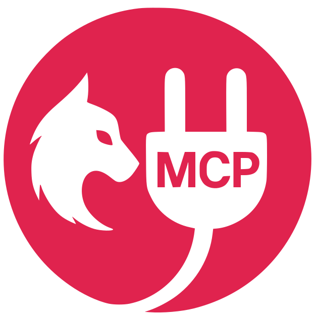

# NestJS MCP Module

<p align="center">
  <a href="https://github.com/bamada/nestjs-mcp" target="blank"></a>
</p>

<p align="center">
  <a href="https://www.npmjs.com/package/nestjs-slack-bolt" target="_blank"></a>
  <a href="https://www.npmjs.com/package/nestjs-slack-bolt" target="_blank"></a>
  <a href="https://www.npmjs.com/package/nestjs-slack-bolt" target="_blank"></a>
  <a href="https://github.com/bamada/nest-slack-bolt/actions"></a>
  <a href="https://github.com/bamada/nest-slack-bolt#contributors-"></a>
  <a href="https://github.com/prettier/prettier"></a>
</p>

A NestJS module providing seamless integration for implementing [Model Context Protocol (MCP)](https://modelcontextprotocol.org/) servers. This module simplifies the process of exposing resources, tools, and prompts to MCP clients using familiar NestJS method decorators (`@McpResource`, `@McpTool`, `@McpPrompt`) and patterns. It supports multiple transport layers, including STDIO and HTTP/SSE.

## Table of Contents

* [Features](#features)
* [Installation](#installation)
* [Peer Dependencies](#peer-dependencies)
* [Quick Start](#quick-start)
  * [Import `McpModule`](#import-mcpmodule)
  * [Create an MCP Provider](#create-an-mcp-provider)
    * [MCP Tool Example](#mcp-tool-example)
    * [MCP Resource Examples](#mcp-resource-examples)
    * [MCP Prompt Example](#mcp-prompt-example)
  * [Use `StderrLogger` (for STDIO Transport)](#use-stderrlogger-for-stdio-transport)
  * [Run your application](#run-your-application)
  * [Configuration](#configuration)
* [API Reference (Decorators)](#api-reference-decorators)
* [Development & Contributing](#development--contributing)
* [License](#license)
* [Links](#links)

## ✨ Features

* **Seamless MCP Integration:** Easily build MCP-compliant servers within your NestJS application using the `@modelcontextprotocol/sdk`.
* **Method Decorator-Based:** Define MCP resources, tools, and prompts by decorating methods within your NestJS providers (`@McpResource`, `@McpTool`, `@McpPrompt`).
* **Automatic Discovery:** Uses NestJS discovery mechanisms (`@nestjs/core/discovery`) to find decorated methods.
* **Transport Handling:**
  * Built-in support for **STDIO** transport (ideal for CLI tools).
  * Built-in support for **HTTP/SSE** transport via a dedicated controller (`McpHttpController` at `/api/mcp`).
  * Configurable transport selection.
* **Zod Schemas:** Define tool parameters and prompt arguments using Zod schemas for validation and type safety.
* **NestJS Native:** Built using standard NestJS modules, providers, and dependency injection.
* **Strongly Typed:** Leverages TypeScript for robust development.
* **Configurable:** Supports configuration options via standard `forRoot` and `forRootAsync` patterns.
* **Stderr Logging:** Includes `StderrLogger` to ensure application logs don't interfere with STDIO transport.

## 📦 Installation

First, ensure you have the required peer dependencies installed. Then, install the module:

```bash
# Using npm
npm install @bamada/nestjs-mcp

# Using yarn
yarn add @bamada/nestjs-mcp
```

## ⚠️ Peer Dependencies

This module relies on core NestJS packages, the MCP SDK, and other libraries that need to be installed in your host application. Make sure your `package.json` includes compatible versions of:

* `@modelcontextprotocol/sdk`: `^1.10.2` (or compatible based on your `@bamada/nestjs-mcp` version)
* `@nestjs/platform-express`: `^10.0.0` or `^11.0.0` (or your chosen platform if not Express)
* `zod`: `^3.0.0`

Failure to install these peer dependencies will result in runtime errors.

## 🚀 Quick Start

1. **Import `McpModule`:**
    Import `McpModule` into your root `AppModule` (or feature module) and configure it using `.forRoot()` or `.forRootAsync()`. Provide the required `serverInfo`.

    ```typescript
    // src/app.module.ts
    import { Module } from '@nestjs/common';
    import { McpModule, TransportType } from '@bamada/nestjs-mcp';
    import { MyMcpProvider } from './my-mcp.provider';

    @Module({
      imports: [
        McpModule.forRoot({
          serverInfo: {
            name: 'my-awesome-mcp-app',
            version: '1.0.0',
          },
          serverOptions: {
          },
          transport: TransportType.SSE, // Use HTTP/SSE controller
        }),
      ],
      providers: [MyMcpProvider],
    })
    export class AppModule {}
    ```

2. **Create an MCP Provider:**
    Create a standard NestJS provider (e.g., a service) and decorate its methods with `@McpResource`, `@McpTool`, or `@McpPrompt`.

    ```typescript
    import { Injectable, Logger } from '@nestjs/common';
    import {
      McpResource,
      McpTool,
      McpPrompt,
      ReadResourceResult,
      CallToolResult,
      GetPromptResult,
      RequestHandlerExtra,
      Variables,
      variables { varName: 'value' }
    } from '@bamada/nestjs-mcp';
    import { z } from 'zod';
    @Injectable()
    export class MyMcpProvider {
      private readonly logger = new Logger(MyMcpProvider.name);
     ```

### MCP Tool Example

 ```typescript
      @McpTool({
        name: 'add',
        description: 'Adds two numbers together.',
        paramsSchema: {
          a: z.number().describe('The first number to add'),
          b: z.number().describe('The second number to add'),
          optionalMessage: z.string().optional().describe('An optional message'),
        },
      })
      async addTool(
        params: { a: number; b: number; optionalMessage?: string },
        extra: RequestHandlerExtra,
      ): Promise<CallToolResult> {
        this.logger.log(`Tool 'add' called by client ${extra.clientInfo?.name} with params: ${JSON.stringify(params)}`);
        const sum = params.a + params.b;
        let resultText = `The sum is ${sum}.`;
        if (params.optionalMessage) {
          resultText += ` Your message: ${params.optionalMessage}`;
        }
        return {
          content: [{ type: 'text', text: resultText }],
        };
      }
 ```

### MCP Resource Examples

 ```typescript
      // Fixed Resource
      @McpResource({
        name: 'static-config',
        uri: 'mcp://my-app/config/settings.json',
        description: 'Provides static configuration settings.',
      })
      async getStaticConfig(
         uri: string,
         extra: RequestHandlerExtra
      ): Promise<ReadResourceResult> {
        this.logger.log(`Resource 'static-config' requested for URI: ${uri}`);
        return {
          content: JSON.stringify({ theme: 'dark', featureFlags: ['newUI'] }),
          metadata: { contentType: 'application/json' },
        };
      }
       // Template Resource
      @McpResource({
        name: 'user-profile',
        uriTemplate: 'mcp://my-app/users/{userId}/profile',
        description: 'Provides user profile data based on userId.',
      })
      async getUserProfile(
        uri: string,
        variables: Variables,
        extra: RequestHandlerExtra
      ): Promise<ReadResourceResult> {
        const userId = variables.userId;
        this.logger.log(`Resource 'user-profile' requested for userId: ${userId}`);
        // Fetch user data based on userId...
        const userProfile = { id: userId, name: `User ${userId}`, email: `${userId}@example.com` };
        return {
          content: JSON.stringify(userProfile),
          metadata: { contentType: 'application/json' },
        };
      }
  ```

### MCP Prompt Example

 ```typescript
      @McpPrompt({
        name: 'greetingPrompt',
        description: 'Generates a personalized greeting message',
        arguments: [
          {
            name: 'userName',
            description: 'The name of the person to greet',
            required: true,
          },
          {
            name: 'style',
            description: 'Greeting style (e.g., formal, casual)',
            required: false,
          },
        ],
      })
      async generateGreeting(
        params: { userName: string; style?: string },
        extra: RequestHandlerExtra,
      ): Promise<GetPromptResult> {
        this.logger.log(`Prompt 'greetingPrompt' called with params: ${JSON.stringify(params)}`);
        const greeting = params.style === 'formal' ? 'Greetings' : 'Hello';
        return {
          messages: [
            {
              role: 'assistant',
              content: [
                {
                  type: 'text',
                  text: `${greeting}, ${params.userName}! Welcome.`,
                },
              ],
            },
          ],
          // Optional: context, toolCalls, toolResult etc.
        };
      }
    }
  ```

3. **Use `StderrLogger` (for STDIO Transport):**
    If using `TransportType.STDIO`, ensure NestJS logs go to `stderr` so they don't interfere with MCP communication over `stdout`.

    ```typescript
    import 'reflect-metadata';
    import { NestFactory } from '@nestjs/core';
    import { AppModule } from './app.module';
    import { StderrLogger } from '@bamada/nestjs-mcp';
    async function bootstrap() {
      const app = await NestFactory.create(AppModule, {
        // Use the StderrLogger IF using STDIO transport
        logger: new StderrLogger(),
      });
      await app.listen(3000); // Or app.init() for non-HTTP apps
      console.error('NestJS application started...'); // Log to stderr
    }
    bootstrap();
    ```

4. **Run your application:**
    The module will discover your decorated provider methods and register them with the underlying MCP server. Depending on the configured transport, it will either listen via STDIO or expose endpoints via the `McpHttpController` (default: `/api/mcp/sse` and `/api/mcp/messages`).

### ⚙️ Configuration

Use `McpModule.forRoot(options)` or `McpModule.forRootAsync(options)` to configure the module.

**`McpModuleOptions`:**

```typescript
import { Implementation } from '@modelcontextprotocol/sdk/types';
import { ServerOptions } from '@modelcontextprotocol/sdk/server';
export enum TransportType {
  STDIO = 'stdio',
  SSE = 'sse',
  NONE = 'none',
}
export interface McpModuleOptions {
  /**
   * Required. Server implementation information.
   */
  serverInfo: Implementation;
  /**
   * Optional. Server configuration options passed to the MCP SDK's McpServer.
   * @see https://github.com/modelcontextprotocol/tsp-sdk/blob/main/server/src/server_options.ts
   */
  serverOptions?: ServerOptions;
  /**
   * Optional. Selects the transport mechanism.
   * - `STDIO`: For CLI tools, uses stdin/stdout for MCP, logs to stderr (use StderrLogger).
   * - `SSE`: Assumes HTTP/SSE transport via McpHttpController (default path /api/mcp).
   * - `NONE`: No transport is automatically managed by this module (e.g., for custom transport).
   */
  transport?: TransportType;
}
```

**Synchronous Configuration (`.forRoot`)**

```typescript
import { McpModule, TransportType } from '@bamada/nestjs-mcp';
@Module({
  imports: [
    McpModule.forRoot({
      serverInfo: { name: 'my-mcp-server', version: '0.1.0' },
      transport: TransportType.SSE,
      serverOptions: { maxConnections: 10 },
    }),
  ],
})
export class AppModule {}
```

**Asynchronous Configuration (`.forRootAsync`)**

Useful for injecting `ConfigService` or using factories.

```typescript
import { McpModule, TransportType } from '@bamada/nestjs-mcp';
import { ConfigModule, ConfigService } from '@nestjs/config';
@Module({
  imports: [
    ConfigModule.forRoot(),
    McpModule.forRootAsync({
      imports: [ConfigModule],
      useFactory: (configService: ConfigService) => ({
        serverInfo: {
          name: configService.get<string>('MCP_SERVER_NAME', 'default-mcp-server'),
          version: configService.get<string>('APP_VERSION', '0.0.1'),
        },
        transport: configService.get<TransportType>('MCP_TRANSPORT', TransportType.SSE),
        serverOptions: {
           // Example: get options from config
           maxConnections: configService.get<number>('MCP_MAX_CONNECTIONS'),
        },
      }),
      inject: [ConfigService],
    }),
  ],
})
export class AppModule {}
```

## 📜 API Reference (Decorators)

These decorators are applied to **methods** within your NestJS providers (services).

### `@McpResource(options: ResourceOptions)`

Decorates a method to identify it as an MCP Resource handler. The method will receive the requested `uri`, extracted `variables` (for templates), and `extra` context, and should return a `ReadResourceResult`.

* `options`: An object conforming to `ResourceOptions` (either `FixedResourceOptions` or `TemplateResourceOptions`):
  * `name`: (string) **Required**. Unique identifier for the resource.
  * `description?`: (string) Optional description.
  * `uri`: (string) **Required for fixed resources**. The exact URI of the resource.
  * `uriTemplate`: (string | ResourceTemplate) **Required for template resources**. The URI pattern (e.g., `/users/{id}`).
  * `metadata?`: (ResourceMetadata) Optional metadata like `contentType`, `schema`, etc.

### `@McpTool(options: ToolOptions)`

Decorates a method to expose it as an MCP Tool. The method will receive the validated `params` object (matching `paramsSchema`) and `extra` context, and should return a `CallToolResult`.

* `options`: An object conforming to `ToolOptions`:
  * `name`: (string) **Required**. Unique identifier for the tool.
  * `description?`: (string) Optional description of what the tool does.
  * `paramsSchema?`: (`ZodRawShape`) Optional. A Zod raw shape object defining the tool's input parameters. Keys are parameter names, values are Zod schemas (e.g., `z.string()`, `z.number().optional()`). Use `.describe()` on Zod schemas to provide descriptions for the MCP client.

### `@McpPrompt(options: PromptType)`

Decorates a method to expose it as an MCP Prompt handler. The method will receive the validated `params` object (matching the `arguments` definition) and `extra` context, and should return a `GetPromptResult`.

* `options`: An object conforming to the `Prompt` type from `@modelcontextprotocol/sdk/types.js`:
  * `name`: (string) **Required**. Unique identifier for the prompt.
  * `description?`: (string) Optional description.
  * `arguments?`: (Array) Optional array defining the prompt's input arguments:
    * `name`: (string) **Required**. Parameter name (must match keys in the handler's `params` object).
    * `description?`: (string) Optional parameter description.
    * `required?`: (boolean) Whether the argument is required (default: false).
  * `input?`: (PromptInputDefinition) Defines expected input format (e.g., text, image).
  * `output?`: (PromptOutputDefinition) Defines expected output format.

## 🛠️ Development & Contributing

Contributions are welcome! Please follow these steps:

1. **Fork & Clone:** Fork the repository and clone it locally.

    ```bash
    git clone https://github.com/YOUR_USERNAME/nestjs-mcp.git
    cd nestjs-mcp
    ```

2. **Install Dependencies:**

    ```bash
    npm install
    # or
    yarn install
    ```

3. **Development:** Make your changes in the `src` directory. Use `npm link` or Yarn/PNPM workspaces for local development against a consuming application.
4. **Lint & Format:** Ensure code quality and consistency.

    ```bash
    npm run lint
    npm run format
    ```

5. **Build:** Compile TypeScript to JavaScript.

    ```bash
    npm run build
    ```

6. **Test:** Run the test suite.

    ```bash
    npm test
    # For coverage:
    npm run test:cov
    ```

7. **Commit & Push:** Commit your changes with clear messages.
8. **Create Pull Request:** Open a PR against the `main` branch of the original repository.

Please report bugs or suggest features using the [GitHub Issues](https://github.com/bamada/nestjs-mcp/issues) page.

## 📜 License

This project is licensed under the MIT License - see the [LICENSE](LICENSE) file for details.

## 🔗 Links

* **Author:** [bamada](https://github.com/bamada)
* **Repository:** [https://github.com/bamada/nestjs-mcp](https://github.com/bamada/nestjs-mcp)
* **Issues:** [https://github.com/bamada/nestjs-mcp/issues](https://github.com/bamada/nestjs-mcp/issues)
* **Model Context Protocol:** [https://modelcontextprotocol.org/](https://modelcontextprotocol.org/)
* **MCP TypeScript SDK:** [https://github.com/modelcontextprotocol/tsp-sdk](https://github.com/modelcontextprotocol/tsp-sdk)
